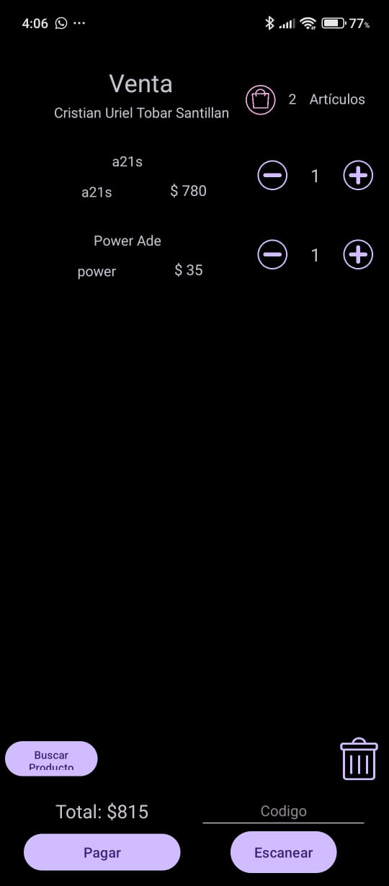
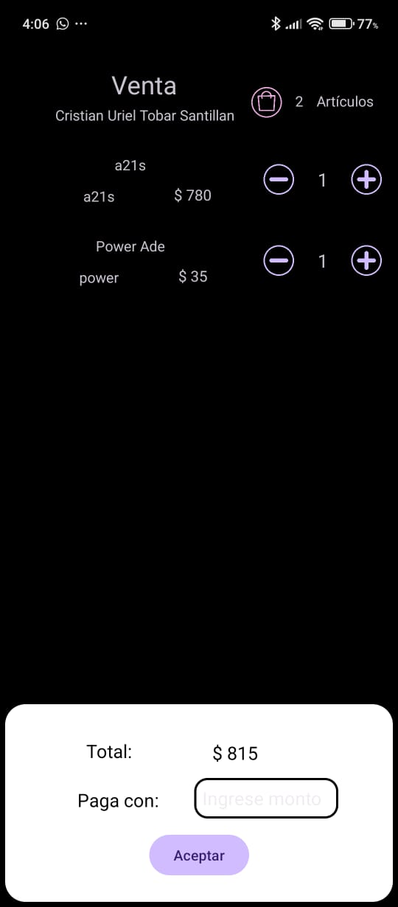
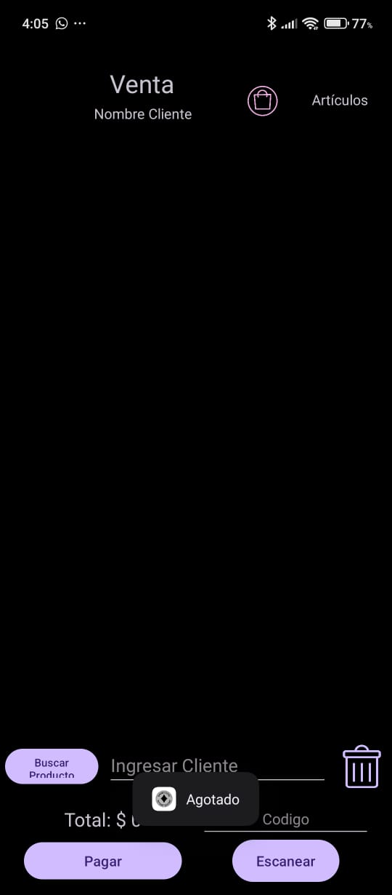
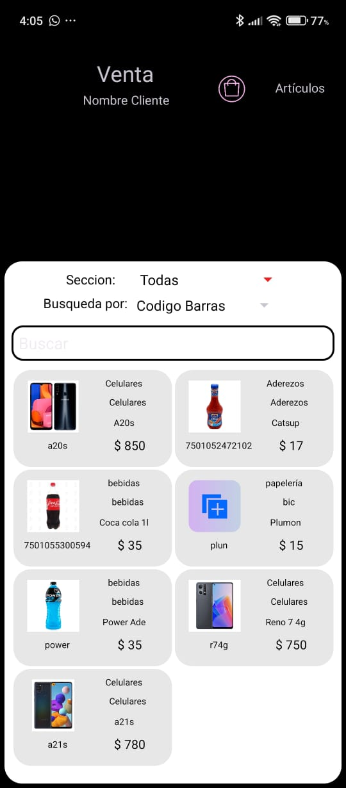
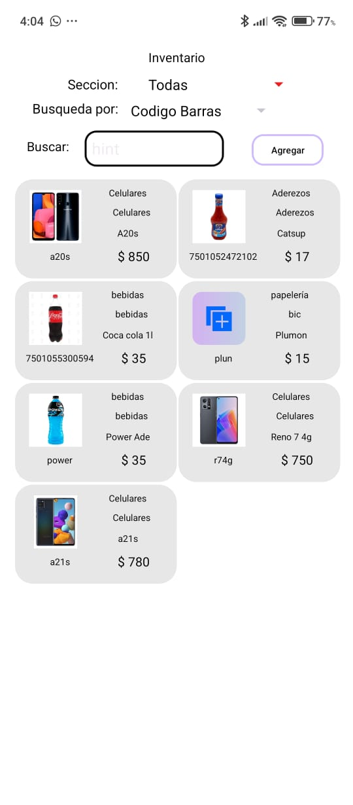
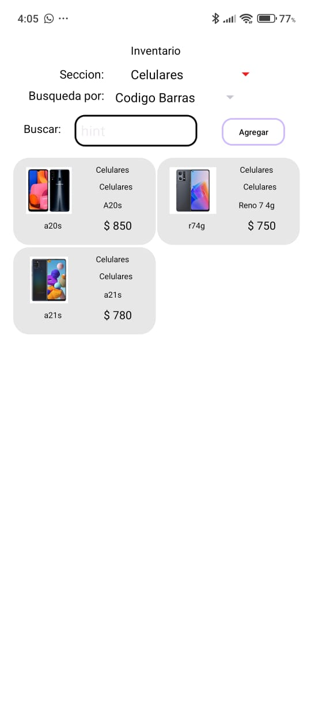

# DiamondStore - Sistema de Punto de Venta (POS) Android

> Aplicación nativa de gestión de inventarios y ventas diseñada para pequeños comercios, con enfoque en eficiencia y experiencia de usuario.

##  Galería de Funcionalidades

###  Punto de Venta (POS)
El módulo principal permite una gestión fluida de la venta, con cálculo automático y validaciones en tiempo real.

| Gestión del Carrito | Proceso de Cobro |
|:---:|:---:|
|  |  |
| **Control de Stock y Errores** | **Búsqueda Rápida** |
|  |  |
*(El sistema valida existencias y notifica al usuario si un producto está agotado)*

### Gestión de Inventario
Visualización clara de productos con soporte para imágenes y filtros dinámicos.

| Catálogo Visual | Filtrado y Búsqueda |
|:---:|:---:|
|  |  |

## Características Principales

###  Módulo de Ventas
* **Escáner Integrado:** Lectura de códigos de barras en tiempo real usando la cámara del dispositivo (Zxing Library).
* **Carrito Dinámico:** Cálculo automático de totales, manejo de stock en tiempo real y validación de disponibilidad.
* **Flujo de Caja:** Registro de ventas con fecha, hora y método de pago.

###  Gestión de Inventario (CRUD)
* **Alta de Productos:** Formulario inteligente con validación de datos.
* **Gestión de Imágenes:** Algoritmo propio de compresión y redimensionamiento de Bitmaps para almacenamiento eficiente en memoria interna.
* **Búsqueda Avanzada:** Filtrado por categorías y búsqueda predictiva en tiempo real.

##  Ingeniería y Arquitectura

Este proyecto fue construido siguiendo las mejores prácticas de desarrollo moderno en Android:

* **Patrón MVVM (Model-View-ViewModel):** Desacoplamiento total entre la lógica de negocio y la interfaz de usuario.
* **DAO Pattern:** Capa de acceso a datos abstracta para gestionar las operaciones CRUD en SQLite de forma segura.
* **Clean Code:** Uso de clases de utilidad (`ImageUtils`, `Constants`) y separación de responsabilidades.
* **Manejo de Ciclo de Vida:** Prevención de fugas de memoria y crashes mediante gestión correcta de Contextos y Fragments.

##  Stack Tecnológico
* **Lenguaje:** Java 11
* **IDE:** Android Studio Ladybug
* **Base de Datos:** SQLite (Nativa)
* **UI:** XML Layouts, Material Design Components, RecyclerView optimizados.
* **Librerías Externas:** ZXing (Barcode Scanner).

---
*Desarrollado por [Cristian Uriel Tobar Santillan]*
*Técnico en Programación | Android Developer*
